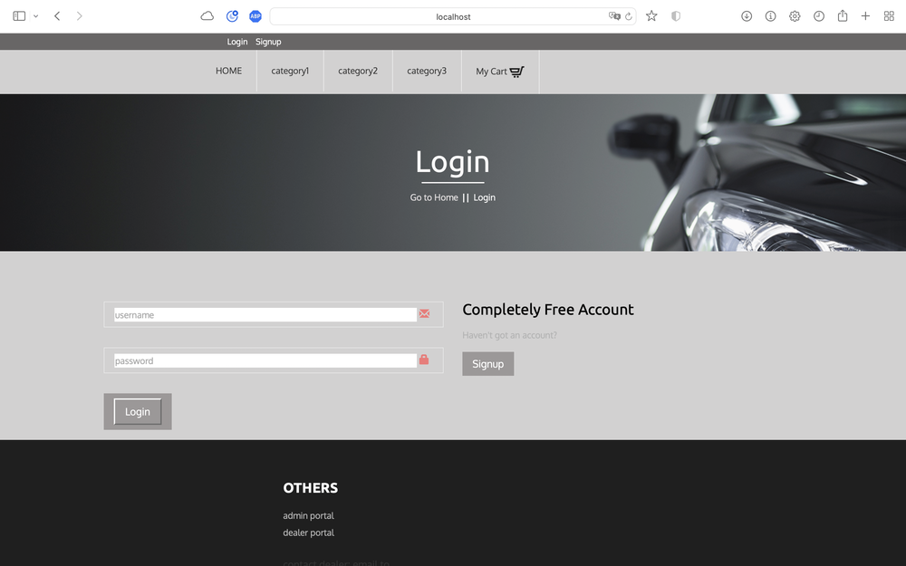
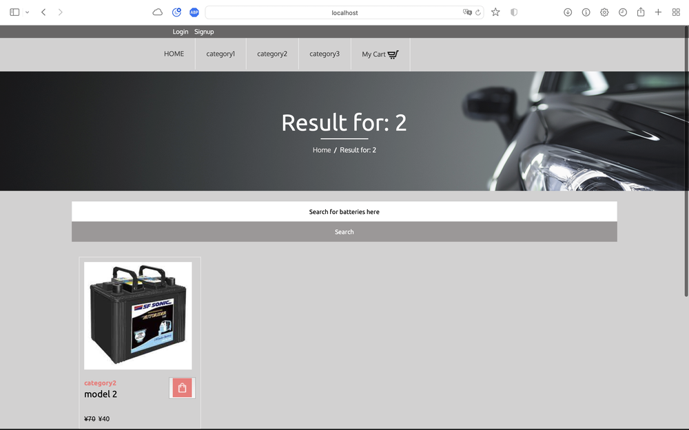
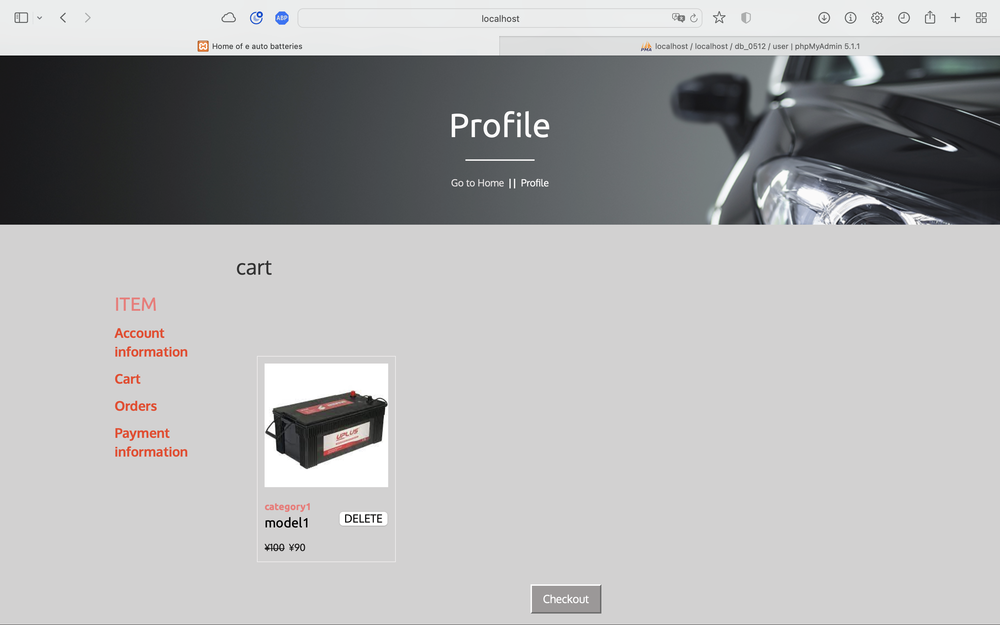
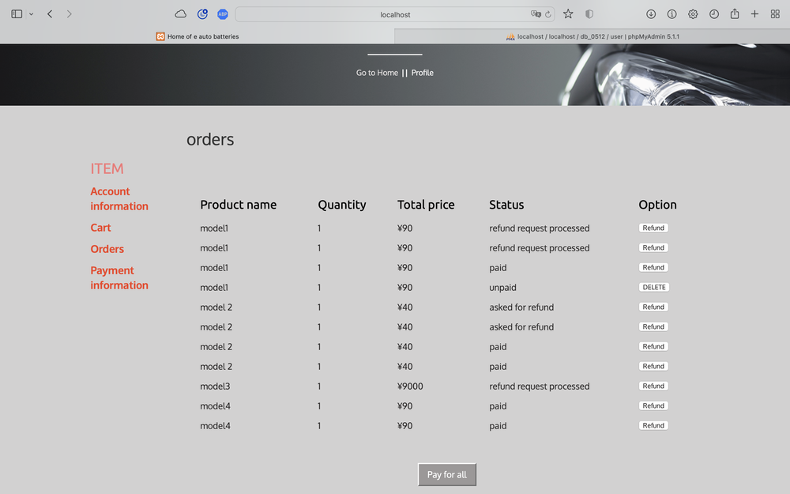

# ecommerce-solution-php

## This is a ecommerce web solution implemented with php

This project requires XAMPP environment, and the .sql is the database dump.

## Acknowledgement

### This is a group project and contributors are:

1. Leo M.
2. Joe F.
3. Yingshuang Z.
4. Demi L.
5. Jizheng C.

CSS templates are found by my team mates and I implemented the design and functions.

## User groups

1. buyers
2. dealers
3. Administrators

## Key functions

1. login
   
2. register
3. Edit account
   
4. Browse goods
5. Search for goods
   
6. Browse goods information
7. Manage cart
   
8. Purchase and payment (mock)
9. Refund
10. Add payment method
    
11. Browse orders
    
12. Talk to customer service (mock)
13. Browse inventory
14. Manage product status
15. Manage orders
16. Browse sales statistics
17. Browse dealer data

## How to run

clone this resipetory to XAMPP/xamppfiles/htdocs
